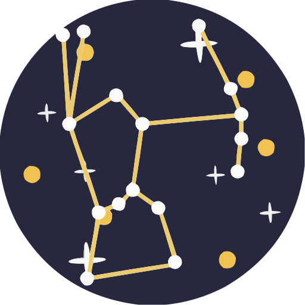

<div align="center">
  
</div>

# :stars: Astro

Another bucket for [Scoop](https://scoop.sh/), with collection of tools for amateur astronomers and astrophotography enthusiasts.

## Usage

```powershell
scoop bucket add astro https://github.com/aliesbelik/astro
# Recommended, but you can omit the bucket name most of the time
scoop install astro/<app>
```

## Apps

> Only apps NOT available in `scoop bucket known` buckets.

- [astral](https://github.com/sj14/astral) - Calculations for the position of the sun and moon.
- [astrarium](https://github.com/Astrarium/Astrarium) - A free and open source desktop planetarium software for Windows.
- [astroterm](https://github.com/da-luce/astroterm) - A terminal-based star map written in C.
- [daylight](https://github.com/jbreckmckye/daylight) - A command-line program for tracking sunrise and sunset times.
- [kstars](https://kstars.kde.org/) - KStars by KDE, a freely licensed, open source, cross-platform astronomy software.
- [spacepixels](https://github.com/ppissias/SpacePixels) - A desktop and command-line FITS workflow for finding moving and transient objects in aligned astronomical image sequences.

## Known

- [celestia](https://celestiaproject.space/) - Celestia, use `extras/celestia`.
- [pipp](https://web.archive.org/web/20230604160543/https://sites.google.com/site/astropipp/home) - PIPP (Planetary Imaging PreProcessor), use `extras/pipp`.
- [spacescape](https://web.archive.org/web/20260310150844/http://alexcpeterson.com/spacescape/) - Spacescape, use `extras/spacescape`.
- [stellarium](https://stellarium.org/) - Stellarium, use `extras/stellarium`.
- [tracker](https://github.com/ShenMian/tracker) - Tracker, use `extras/tracker`.
